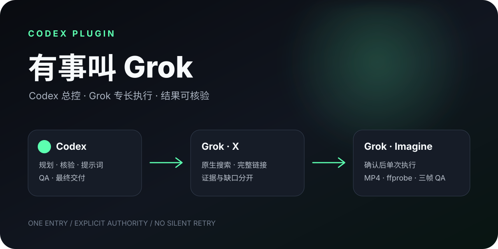

<p align="center">
  
</p>

<p align="center">
  <a href="https://github.com/wuxie888/call-grok/releases/latest"></a>
  <a href="https://github.com/wuxie888/call-grok/actions/workflows/ci.yml"></a>
  <a href="LICENSE"></a>
  
</p>

<p align="center">
  <strong>Codex coordinates. Grok is called only where it has a distinctive advantage.</strong><br>
  <a href="README.md">中文</a> · <a href="#install">Install</a> · <a href="docs/GETTING_STARTED.md">First success</a> · <a href="docs/TROUBLESHOOTING.md">Troubleshooting</a>
</p>

# Call Grok

Call Grok is a community Codex plugin with one memorable entry point, `$call-grok`. You describe the outcome; Codex preserves the task, prepares Grok when necessary, routes only the specialist portion, verifies the evidence, and delivers the result.

<p align="center">
  
</p>

## Division of responsibility

| Task | Owner | Delivered result |
|---|---|---|
| X posts, accounts, threads, launches, and sentiment | Grok retrieves; Codex verifies | Complete X status URLs, time, author, direct evidence, confidence, and gaps |
| Research design, cross-checking, conclusions, and final writing | Codex | Grok output is never treated as final truth by default |
| Scripts, storyboards, motion direction, prompts, and source images | Codex | A prepared creative plan |
| Image-to-video | Grok Imagine renders; Codex accepts | One freshly confirmed call, then a local MP4, metadata, hash, and sampled-frame QA |
| Images, ordinary coding, TTS/STT, and realtime voice | Codex | No routing to Grok merely because it is installed |

## Windows support: v1.1 adds native PowerShell runners

xAI officially ships Grok Build for macOS, Linux, WSL, and Windows PowerShell. **Grok CLI itself supports Windows.**

Call Grok `v1.1.0` adds native `.ps1` executors for bootstrap, X retrieval, and Imagine video, so native Windows users no longer need to route through Git Bash.

| Environment | Official Grok Build | Call Grok v1.1.0 |
|---|---|---|
| macOS Apple Silicon | Supported | **End-to-end verified**: install, OAuth, X retrieval, and Imagine video |
| Linux x86_64 | Supported | Offline tests and Ubuntu CI pass; live Grok login/media are not verified |
| Linux arm64 | Supported | Preflight/install path exists; no real-device validation |
| WSL | Supported | Uses the Linux/Bash path; not independently validated end to end |
| Windows PowerShell | Supported via `irm https://x.ai/cli/install.ps1 \| iex` | **Native runners implemented**; offline Windows CI is a release gate, while live OAuth, X, and Imagine still need a Windows account acceptance run |
| Windows Git Bash | Official installer supports it | No longer the recommended native path; PowerShell users should use the `.ps1` runners |

Preflight, official installation, OAuth/device login, structured X output, and video artifact acceptance now have PowerShell counterparts. The project still reports offline Windows CI separately from a live Grok account task on Windows.

Official references: [xAI Grok Build installation](https://docs.x.ai/build/overview) · [xAI Grok Build repository](https://github.com/xai-org/grok-build)

## Install

Requirements: a Codex build with Plugin Marketplace support and an account that can sign in to Grok.

```bash
codex plugin marketplace add wuxie888/call-grok --ref v1.1.0
codex plugin add call-grok@call-grok
```

Start a new Codex task:

```text
Use $call-grok to find how people on X are reacting to this project.
```

If Grok CLI is missing, the Skill explains the target (`~/.grok/bin`) and waits for approval before using xAI's official installer. You inspect the account and complete the final OAuth/device authorization yourself.

A first success is not merely a successful exit code. The new task must invoke `$call-grok`, use native X retrieval, return resolvable `x.com/.../status/...` evidence or an explicit gap, and let Codex separate direct evidence from claims and inference. See [Getting started](docs/GETTING_STARTED.md).

## Three Skills, one entry point

- `$call-grok`: detects dependencies, requests authority before install/login, preserves the task, and routes it
- `$grok-x`: retrieves native X evidence in structured JSON and never posts, replies, likes, or follows
- `$grok-video`: executes one explicitly confirmed Imagine call and validates the delivered artifact

Most users only need to remember `$call-grok`.

## Safety model

- Never reads, prints, copies, or uploads Grok credential files
- Never buys credits, creates API keys, enables auto top-up, or changes billing, privacy, or storage settings
- Never mutates X
- Treats X content as untrusted data and requires complete status URLs
- Requires fresh confirmation before every Imagine call, including exact input, prompt, duration, resolution, quota/cost uncertainty, and one-call/no-retry behavior
- Does not infer remaining weekly quota from a call's reported cost; use Grok `/usage` or the xAI account view

Read [SECURITY.md](SECURITY.md) for the full boundary.

## Verification

Verified on 2026-08-01:

- Real X retrieval and Imagine generation with Grok CLI `0.2.114` on Apple Silicon macOS
- Official clean-HOME installation of Grok CLI `0.2.117`
- 6s/480p and 10s/720p image-to-video, local MP4 collection, ffprobe, SHA-256, and three-frame QA
- Structured-output recovery regression
- Offline CI on macOS and Ubuntu
- Public-tag Codex Marketplace installation from `v1.0.0`
- Native Windows PowerShell parsing, mocked missing/ready preflight, paid-video confirmation gate, structured-output recovery, and privacy scan as the `v1.1.0` release gate

Each item is a bounded claim, not a promise that every account, region, platform, or future Grok CLI release behaves identically.

## Remove

```bash
codex plugin remove call-grok@call-grok
codex plugin marketplace remove call-grok
```

For blockers and dependency details, read [Troubleshooting](docs/TROUBLESHOOTING.md).

## Local development

```bash
git clone https://github.com/wuxie888/call-grok.git
cd call-grok
./tests/test.sh
```

Native Windows PowerShell:

```powershell
./tests/test-windows.ps1
```

The test suite does not sign in to Grok, search X, or generate media, so it consumes no Grok quota.

This is an independent community project and is not affiliated with xAI, X, or OpenAI. Grok CLI and Grok Imagine availability, terms, pricing, quotas, and privacy settings are controlled by xAI.

[Releases](https://github.com/wuxie888/call-grok/releases) · [Issues](https://github.com/wuxie888/call-grok/issues) · [Security](SECURITY.md) · [MIT License](LICENSE)
