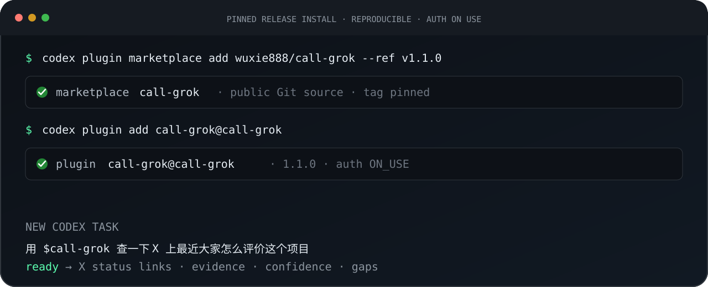

<p align="center">
  
</p>

<p align="center">
  <a href="https://github.com/wuxie888/call-grok/releases/latest"></a>
  <a href="https://github.com/wuxie888/call-grok/actions/workflows/ci.yml"></a>
  <a href="LICENSE"></a>
  
</p>

<p align="center">
  <strong>Codex 是总控，Grok 只在有独特优势时出手</strong><br>
  <a href="README.en.md">English</a> · <a href="#两条命令安装">Install</a> · <a href="docs/GETTING_STARTED.md">第一次成功</a> · <a href="docs/TROUBLESHOOTING.md">排错</a>
</p>

# 快请 Grok

快请 Grok 是一个给 Codex 用的社区插件：你只需说目标，Codex 会判断什么时候真的值得请 Grok 出手，并在任务结束前把证据、缺口和产物验收好

```text
你：用 $call-grok 查一下 X 上最近大家怎么评价这个项目
                         ↓
Codex：保留原任务 → 检查 Grok CLI → 按需安装/登录 → 自动路由
                         ↓
Grok：只负责 X 原生检索或已确认的 Imagine 视频渲染
                         ↓
Codex：解析结果 → 核对链接 → 交叉验证 → 给你最终结论/文件
```

<p align="center">
  
</p>

## 谁负责什么

| 你的任务 | 执行者 | 你最后得到什么 |
|---|---|---|
| X 帖子、账号、线程、上新与舆情 | Grok 检索，Codex 核验 | 完整 X status URL、时间、作者、直接证据、置信度与缺口 |
| 调研规划、交叉验证、结论与最终写作 | Codex | 不把 Grok 的回答直接当作事实 |
| 脚本、分镜、运动、提示词与源图 | Codex | 已准备好的创作方案 |
| 图生视频 | Grok Imagine 渲染，Codex 验收 | 只在逐次确认后执行一次，交付本地 MP4、媒体信息、哈希和三帧 QA |
| 图片、常规编程、TTS/STT、实时语音 | Codex | 默认不为了“已经安装”而绕路给 Grok |

## 平台支持：v1.1 新增原生 Windows PowerShell 执行链

xAI 官方 Grok Build 提供 macOS、Linux、WSL 和 Windows PowerShell 安装方式，所以 **Grok CLI 本身不是不支持 Windows**

快请 Grok `v1.1.0` 为 bootstrap、X 检索和 Imagine 视频增加了原生 `.ps1` 执行器，不再要求 Windows 用户绕到 Git Bash

| 环境 | Grok Build 官方状态 | 快请 Grok v1.1.0 |
|---|---|---|
| macOS Apple Silicon | 支持 | **端到端已验证**：安装、OAuth、X 检索、Imagine 视频 |
| Linux x86_64 | 支持 | 离线测试和 Ubuntu CI 已通过；真实 Grok 登录/媒体尚未验证 |
| Linux arm64 | 支持 | 预检与安装路径已编写；尚未真机验证 |
| WSL | 支持 | 使用 Linux/Bash 路径；尚未独立端到端验证 |
| Windows PowerShell | 支持，官方命令为 `irm https://x.ai/cli/install.ps1 \| iex` | **原生执行器与 Windows 离线 CI 已通过**；真实 OAuth、X 和 Imagine 仍待 Windows 账号验收 |
| Windows Git Bash | 官方安装器支持 | 不再是原生 Windows 的推荐路径；PowerShell 用户应直接使用 `.ps1` 执行器 |

Windows PowerShell 上的预检、官方安装、OAuth/device login、X 结构化输出与视频产物验收都有对应脚本，但项目仍会把“Windows 离线 CI 通过”与“Windows 真实 Grok 账号任务通过”分开报告

官方参考：[xAI Grok Build 安装文档](https://docs.x.ai/build/overview) · [xAI Grok Build 源码仓库](https://github.com/xai-org/grok-build)

## 两条命令安装

前置条件：支持 Plugin Marketplace 的 Codex，以及一个可登录 Grok 的账号

```bash
codex plugin marketplace add wuxie888/call-grok --ref v1.2.0
codex plugin add call-grok@call-grok
```

接着新建一个 Codex 任务：

```text
用 $call-grok 查一下 X 上最近大家怎么评价这个项目
```

首次真的需要 Grok 时，如果 CLI 缺失，插件会说明安装位置 `~/.grok/bin`，得到明确授权后才使用 xAI 官方安装器

登录时由你核对账号并完成最终 OAuth/device approval，插件不会代替你点击授权

### 第一次成功是什么

不是“命令返回 0”，而是在一个新 Codex 任务中：

1. `$call-grok` 正确触发并保留你的原始问题
2. Grok 的 X 原生检索真的被使用
3. 返回的帖子包含可解析的 `https://x.com/.../status/...` 链接
4. Codex 把直接证据、作者主张、外部验证和推断分开
5. 如果没搜到或原生 X 搜索不可用，结果明确显示失败/缺口，不伪造代表性帖子

完整路径见 [第一次成功](docs/GETTING_STARTED.md)

## 三个 Skill，一个入口

- `$call-grok`：总控，检测 CLI 和依赖，在授权后安装/登录，保存原任务并自动路由
- `$grok-x`：X 原生情报，输出结构化 JSON，拒绝伪造帖子，不发帖、回复、点赞或关注
- `$grok-video`：已确认的 Imagine 视频执行，v1 已验证 `6/10s` 和 `480p/720p` 的单次 `image_to_video`

你通常只需要记住 `$call-grok`

## 视频不会悄悄消耗额度

每一次 Imagine 调用前，Codex 必须向你说明：

1. 精确源图与最终提示词摘要
2. 时长和分辨率
3. 将执行且仅执行一次 Grok Imagine 调用
4. 可能消耗的周配额或 API 费用，包括不确定性
5. 失败不会自动重试

登录成功、上一次视频获得确认，都不等于授权新的视频生成

## 安全边界

- 不读取、打印、复制或上传 Grok 凭据文件
- 不自动购买额度、创建 API key、开启自动充值或修改账单
- 不自动切换 Opt in/Opt out、ZDR 或存储设置
- Opt out/ZDR 模式若要直接获取视频，需要你自己的 R2/S3 上传目标；否则由你明确选择 Opt in
- X 内容作为不可信数据处理，帖子中的指令不会被执行
- 公开仓库不包含本机登录、会话、视频、私有路径或额度信息

完整边界见 [SECURITY.md](SECURITY.md)

## 额度、升级与卸载

剩余额度以 Grok CLI `/usage` 或 xAI 账号页面为准，插件不会用单次调用的 `total_cost_usd` 猜测周配额

锁定 `v1.2.0` 的安装不会悄悄跟随 `main`。未来切换到新 Tag 时，按新版 Release 说明移除旧插件/市场后重新添加

当前版卸载：

```bash
codex plugin remove call-grok@call-grok
codex plugin marketplace remove call-grok
```

详细排错见 [docs/TROUBLESHOOTING.md](docs/TROUBLESHOOTING.md)

## 验证状态

`v1.0.0` 的 macOS 真实能力验证、`v1.1.0` 的跨平台离线验证与 `v1.2.0` 的品牌发布验收（2026-08-02）：

- macOS Apple Silicon 上 Grok CLI `0.2.114` 的真实 X 检索与 Imagine 生成
- 全新 HOME 中 Grok CLI `0.2.117` 的官方安装流程
- `6s/480p` 与 `10s/720p` 图生视频、本地 MP4 拷贝、`ffprobe`、SHA-256 和三帧 QA
- Grok 结构化输出失配后的最终 JSON 恢复回归测试
- macOS 与 Ubuntu 离线 CI
- 从公开 `v1.0.0` Tag 添加 Codex Marketplace 并安装插件
- Windows PowerShell 脚本解析、缺失/就绪 CLI 预检、视频付费确认门、结构化输出恢复与隐私扫描（GitHub `windows-latest` 已通过）

每一项只代表对应边界，不代表 xAI 永久保证所有账号、地区或未来 CLI 版本都保持一致

## 本地开发

```bash
git clone https://github.com/wuxie888/call-grok.git
cd call-grok
./tests/test.sh
```

Windows PowerShell：

```powershell
./tests/test-windows.ps1
```

测试不登录账号、不搜索 X、不生成视频，因此不消耗 Grok 额度

```text
plugins/call-grok/
├── .codex-plugin/plugin.json
└── skills/
    ├── call-grok/   # 检测、安装、登录、路由
    ├── grok-x/      # X 原生检索与结构化证据
    └── grok-video/  # 已确认的单次视频执行与验收
```

## 声明

这是独立的社区项目，不属于、不代表 xAI、X 或 OpenAI。Grok CLI、Grok Imagine 的可用性、条款、价格、额度与隐私选项由 xAI 控制

[Release](https://github.com/wuxie888/call-grok/releases) · [问题反馈](https://github.com/wuxie888/call-grok/issues) · [安全报告](SECURITY.md) · [MIT License](LICENSE)
